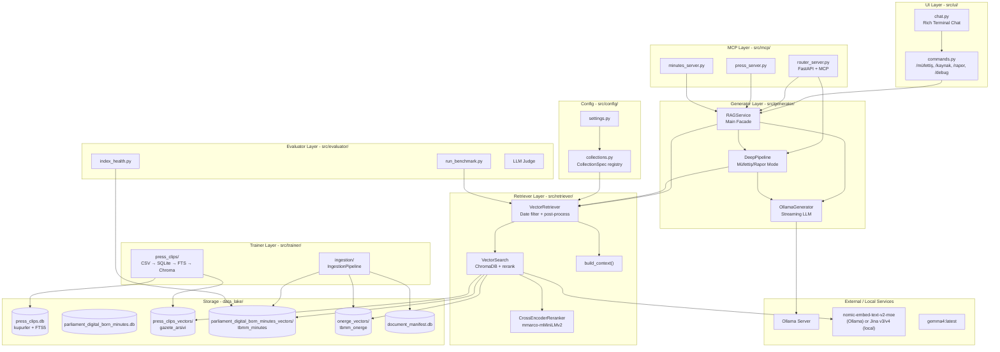
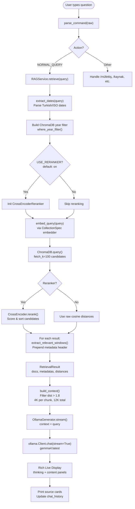
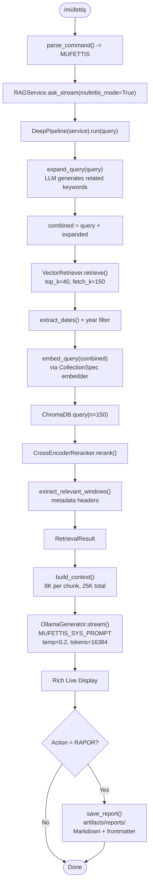
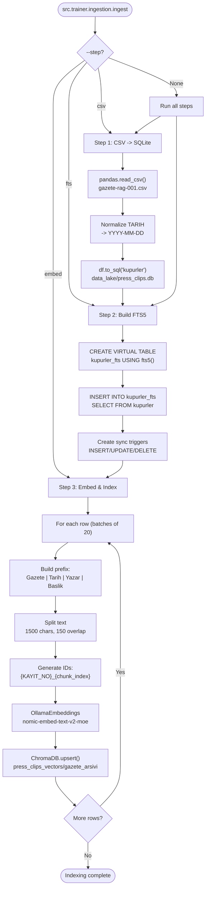
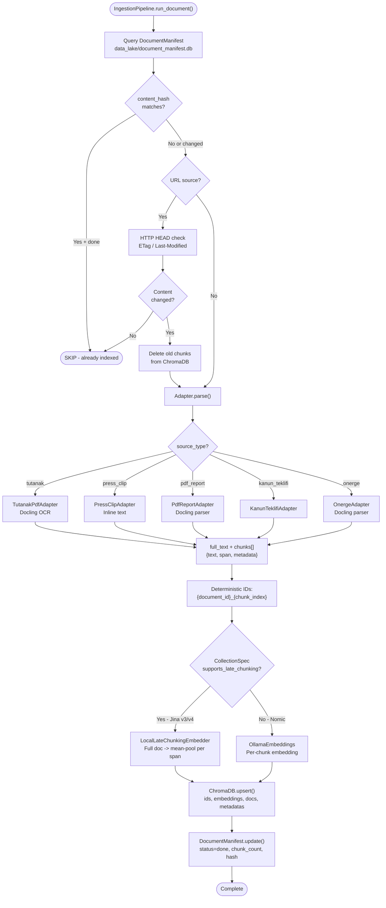
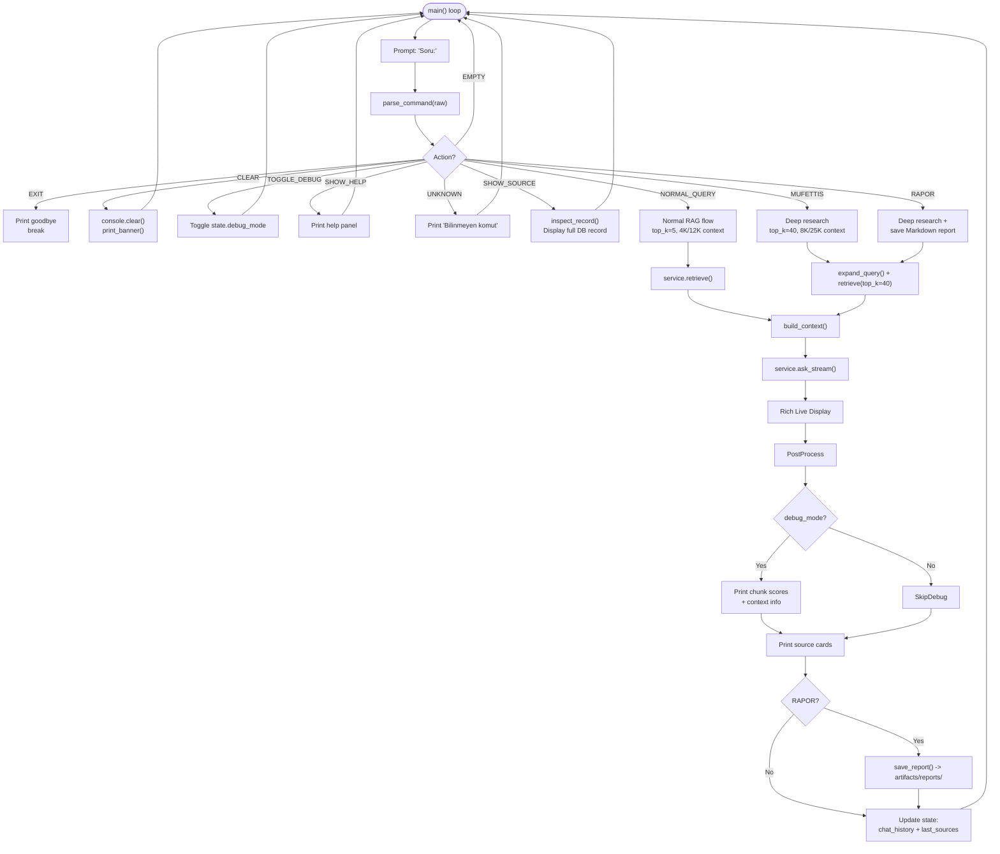
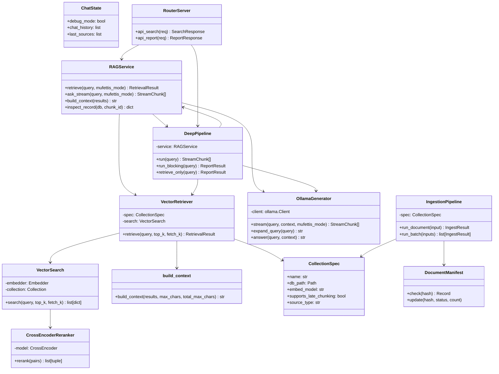
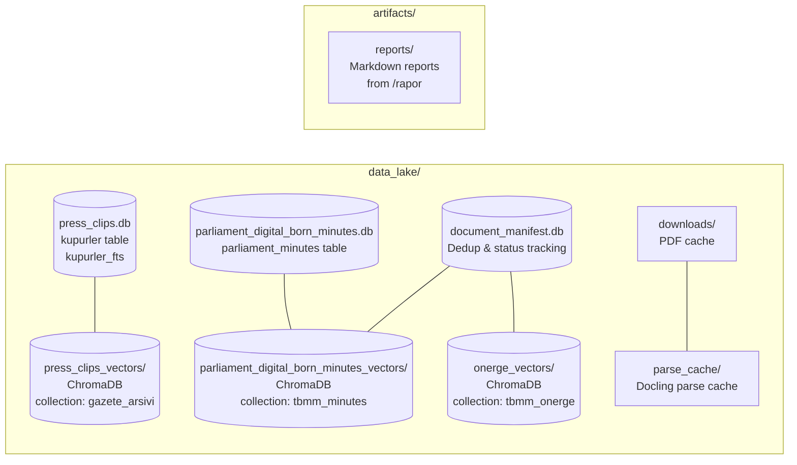

<!-- Preview Shortcut: Cmd + Shift + V (or Cmd + K, V for side-by-side) -->
# Flowcharts

## 1. Overall System Architecture

---

## 2. Query Flow (Normal Mode)

---

## 3. Query Flow (Müfettiş / Deep Research Mode)

---

## 4. Data Ingestion Pipeline (Press Clips)

---

## 5. Unified Ingestion Pipeline

---

## 6. Chat UI Command Flow

---

## 7. Component Relationship Diagram

---

## 8. Data Storage Layout

