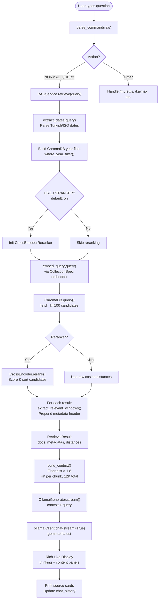
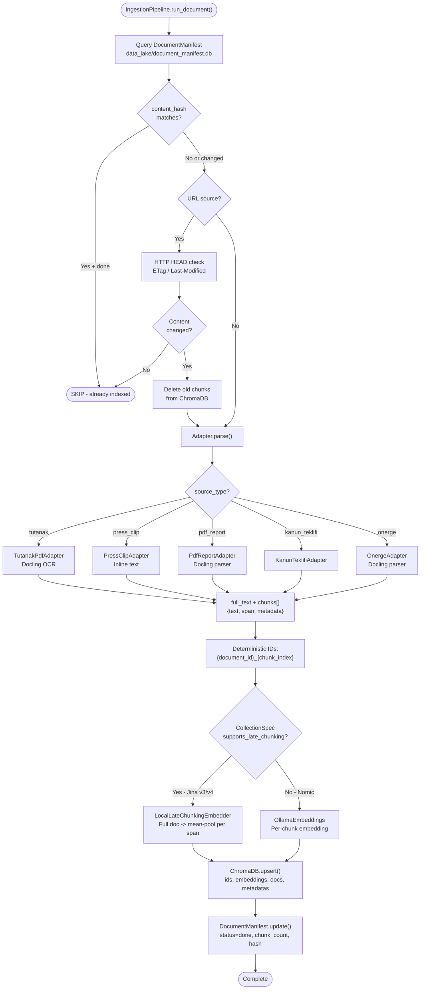
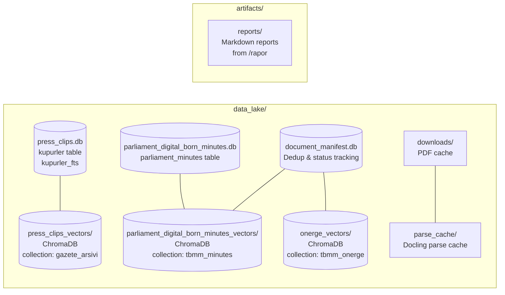

# Presentation: System Flowcharts

## 2. Query Flow (Normal Mode)

```mermaid
flowchart TD
    Start(["User types question"]) --> Parse["parse_command(raw)"]
    Parse --> ActionCheck{Action?}

    ActionCheck -->|NORMAL_QUERY| Retrieve["RAGService.retrieve(query)"]
    ActionCheck -->|Other| OtherActions["Handle /müfettiş, /kaynak, etc."]

    Retrieve --> ExtractDates["extract_dates(query)<br/>Parse Turkish/ISO dates"]
    ExtractDates --> YearFilter["Build ChromaDB year filter<br/>where_year_filter()"]

    YearFilter --> CheckReranker{USE_RERANKER?<br/>default: on}
    CheckReranker -->|Yes| InitReranker["Init CrossEncoderReranker"]
    CheckReranker -->|No| SkipReranker["Skip reranking"]
    InitReranker --> Embed
    SkipReranker --> Embed

    Embed["embed_query(query)<br/>via CollectionSpec embedder"] --> ChromaQuery["ChromaDB.query()<br/>fetch_k=100 candidates"]
    ChromaQuery --> RerankCheck{Reranker?}

    RerankCheck -->|Yes| Rerank["CrossEncoder.rerank()<br/>Score & sort candidates"]
    RerankCheck -->|No| RawResults["Use raw cosine distances"]
    Rerank --> PostProcess
    RawResults --> PostProcess

    PostProcess["For each result:<br/>extract_relevant_windows()<br/>Prepend metadata header"] --> BuildRetrieval["RetrievalResult<br/>docs, metadatas, distances"]

    BuildRetrieval --> BuildContext["build_context()<br/>Filter dist > 1.8<br/>4K per chunk, 12K total"]
    BuildContext --> Stream["OllamaGenerator.stream()<br/>context + query"]
    Stream --> OllamaChat["ollama.Client.chat(stream=True)<br/>gemma4:latest"]
    OllamaChat --> Display["Rich Live Display<br/>thinking + content panels"]
    Display --> Sources["Print source cards<br/>Update chat_history"]
```

---

## 5. Unified Ingestion Pipeline

```mermaid
flowchart TD
    Start(["IngestionPipeline.run_document()"]) --> ManifestCheck["Query DocumentManifest<br/>data_lake/document_manifest.db"]

    ManifestCheck --> HashCheck{content_hash<br/>matches?}
    HashCheck -->|Yes + done| SKIP(["SKIP - already indexed"])
    HashCheck -->|No or changed| URLCheck{URL source?}

    URLCheck -->|Yes| HEAD["HTTP HEAD check<br/>ETag / Last-Modified"]
    URLCheck -->|No| Parse
    HEAD --> Changed{Content<br/>changed?}
    Changed -->|No| SKIP
    Changed -->|Yes| DeleteOld["Delete old chunks<br/>from ChromaDB"]
    DeleteOld --> Parse

    Parse["Adapter.parse()"] --> AdapterCheck{source_type?}

    AdapterCheck -->|tutanak| Tutanak["TutanakPdfAdapter<br/>Docling OCR"]
    AdapterCheck -->|press_clip| Press["PressClipAdapter<br/>Inline text"]
    AdapterCheck -->|pdf_report| PDF["PdfReportAdapter<br/>Docling parser"]
    AdapterCheck -->|kanun_teklifi| Kanun["KanunTeklifiAdapter"]
    AdapterCheck -->|onerge| Onerge["OnergeAdapter<br/>Docling parser"]

    Tutanak --> Chunks["full_text + chunks[]<br/>{text, span, metadata}"]
    Press --> Chunks
    PDF --> Chunks
    Kanun --> Chunks
    Onerge --> Chunks

    Chunks --> ChunkIDs["Deterministic IDs:<br/>{document_id}_{chunk_index}"]

    ChunkIDs --> LateCheck{CollectionSpec<br/>supports_late_chunking?}

    LateCheck -->|Yes - Jina v3/v4| LateChunk["LocalLateChunkingEmbedder<br/>Full doc -> mean-pool per span"]
    LateCheck -->|No - Nomic| StdEmbed["OllamaEmbeddings<br/>Per-chunk embedding"]

    LateChunk --> Upsert["ChromaDB.upsert()<br/>ids, embeddings, docs, metadatas"]
    StdEmbed --> Upsert

    Upsert --> ManifestUpdate["DocumentManifest.update()<br/>status=done, chunk_count, hash"]
    ManifestUpdate --> DONE(["Complete"])
```

---

## 8. Data Storage Layout

```mermaid
graph LR
    subgraph DataLake["data_lake/"]
        PressDB[("press_clips.db<br/>kupurler table<br/>kupurler_fts")]
        MinutesDB[("parliament_digital_born_minutes.db<br/>parliament_minutes table")]
        PressVec[("press_clips_vectors/<br/>ChromaDB<br/>collection: gazete_arsivi")]
        MinutesVec[("parliament_digital_born_minutes_vectors/<br/>ChromaDB<br/>collection: tbmm_minutes")]
        OnergeVec[("onerge_vectors/<br/>ChromaDB<br/>collection: tbmm_onerge")]
        Manifest[("document_manifest.db<br/>Dedup & status tracking")]
        Downloads["downloads/<br/>PDF cache"]
        ParseCache["parse_cache/<br/>Docling parse cache"]
    end

    subgraph Artifacts["artifacts/"]
        Reports["reports/<br/>Markdown reports<br/>from /rapor"]
    end

    PressDB --- PressVec
    MinutesDB --- MinutesVec
    Manifest --- MinutesVec
    Manifest --- OnergeVec
    Downloads --- ParseCache
```
