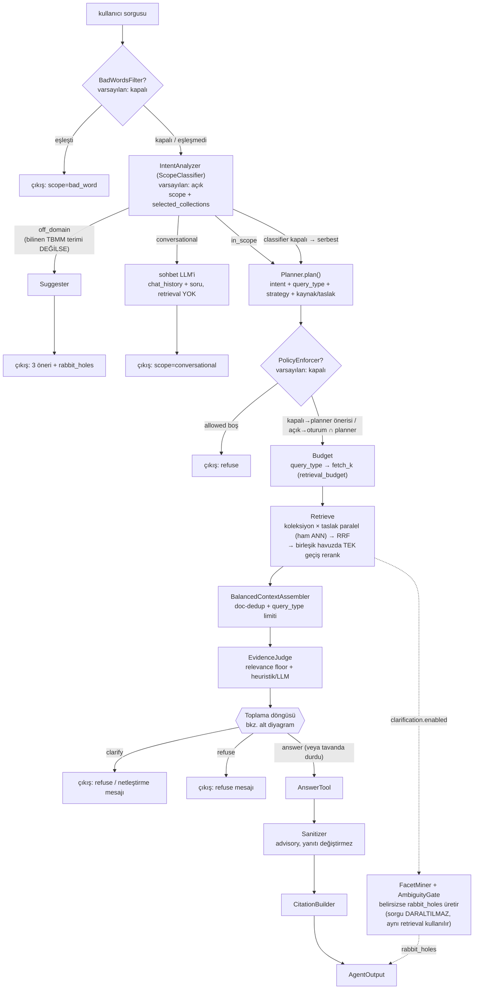
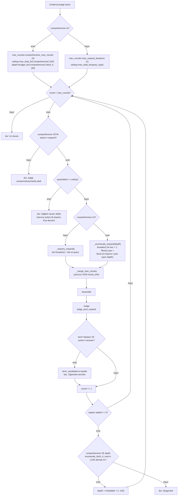
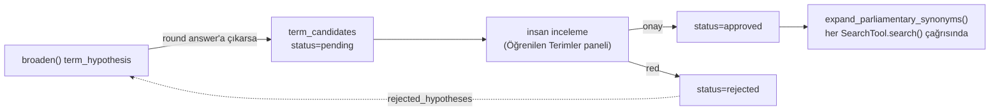
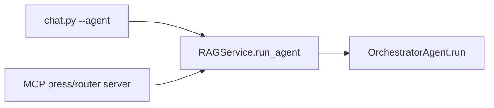

# `src/agent` — Agentic RAG Pipeline (OrchestratorAgent)

Tek bir agentic RAG hattı: `OrchestratorAgent` (`orchestrator.py`). Çok adımlı bir
sorguyu **niyet analizi → planlama → arama → değerlendirme → (gerekirse toplama) →
yanıt** olarak yürüten açık bir state machine'dir. Tek giriş noktası
`RAGService.run_agent()` → `OrchestratorAgent.run()`'dır.

> **Görsel:** [flow_diagram.html](./flow_diagram.html) — aşağıdaki üç diyagramın
> renkli/grafik SVG karşılığı; tarayıcıda doğrudan açılabilir.

Mimari artık ağırlıklı olarak **Planned** (planner'ın tek LLM çağrısında hem sorgu
çeşitlendirmesi hem araştırma stratejisi seçimi) ve sınırlı **ReAct** (judge
yetersiz derse ya da sorgu `comprehensive` ise doygunluğa/tavana kadar süren toplama
döngüsü) öğelerini birleştiren bir yapıdır.

> **Değişti — engelleyici clarification kaldırıldı:** Önceki sürümde belirsiz sorgular
> ayrı bir probe-retrieval + engelleyici "did-you-mean" sorusuna (`AmbiguityGate` →
> interaktif `clarification_callback` ya da otomatik en-güçlü-facet daraltması) çıkardı.
> Bu tasarım tamamen kaldırıldı: artık **hiçbir sorgu daraltılmıyor ya da
> bloklanmıyor**. Belirsizlik tespiti hâlâ çalışıyor ama yalnızca ana retrieval
> sonuçlarından (ayrı bir probe turu **yok**) facet çıkarıp, engellemeyen "rabbit hole"
> öneri çipleri üretiyor (Aşama 3.5). `clarification_callback` ve `deep_mode`
> parametreleri geriye dönük uyumluluk için hâlâ kabul ediliyor ama orchestrator artık
> ikisini de hiç okumuyor — bkz.
> `tests/test_orchestrator.py::test_orchestrator_rabbit_holes_callback_ignored`.

## Akış



Notlar (diyagramda görünmeyen ama davranışı belirleyen ayrıntılar):

- **off_domain → in_scope zorlaması:** `scope=off_domain` olsa bile sorguda bilinen bir
  TBMM/yasama terimi geçiyorsa (`_is_known_parliamentary_term`, örn. "kadük") in_scope'a
  zorlanır — küçük classifier modelinin sözlük-sorusu sanıp yanlış sınıflandırdığı
  durumlara karşı deterministik güvenlik ağı.
- **conversational tamamen yeni bir kısayoldur:** selamlaşma / teşekkür / "az önce ne
  sordum" gibi sorular hiç retrieval çalıştırmadan `chat_history` üzerinden küçük bir
  LLM çağrısıyla yanıtlanır.
- **Budget artık koşulsuz:** eski `AllocationPlanner` (stage-2, `allocator.py`) kaldırıldı;
  `query_type → fetch_k` eşlemesi düz bir config okuması (`RetrievalBudgetConfig`), ayrı
  bir on/off bayrağı yok. Tüm fused sonuçlar tek bir havuza akar (primary/reserve ayrımı
  yok).
- **Facet mining ayrı bir arama YAPMAZ:** Aşama 3'teki ana retrieval sonuçları
  (`state.retrieval_results`) hem Assembler'a hem `FacetMiner`'a girdi olur; eski "ayrı
  20-sonuçluk probe" turu kaldırıldı.
- **`no_allowed_collections` çıkışı fiilen Policy'den hemen sonra olur**; Budget'taki
  ikinci boş-kontrol pratikte erişilemez bir savunma (allowed doluysa `_flat_plans_for`
  her zaman aynı sayıda plan üretir).
- **Rerank artık taslak-başına değil, birleşme-sonrası tek geçiş:** `SearchTool.search()`
  `apply_reranker=False` ile ham ANN sırasıyla çağrılır; her koleksiyonun taslakları RRF
  ile birleştikten SONRA `SearchTool.rerank()` deduped havuzu TEK seferde reranklar. Eskiden
  her taslak kendi rerank'ını çalıştırıyordu (N taslak → N cross-encoder geçişi, aynı model
  için gereksiz çakışma; RRF zaten çoğunu eleyecekti).
- **IntentAnalyzer'ın koleksiyon kataloğu şu an yalnızca tutanak:** `agent.classifier.prompt`
  (`pipeline.yaml`), gazete/önerge doc_type'larının henüz indekslenmiş bir koleksiyonu
  olmadığını açıkça belirtiyor ve `{catalog}`'da karşılığı olmayan bir isim üretmeyi
  yasaklıyor. `Planner`'ın `PLAN_SYSTEM_PROMPT`'undaki gazete/önerge yönlendirme kuralları
  bu yüzden şu an fiilen ölü kod gibi davranır — `get_collection_catalog()` boş katalog
  döndürdüğü sürece hiçbir zaman tetiklenmezler.

### Toplama (genişletme) döngüsü

Aşama 5.1 tek seferlik "expand" değil, doygunluğa/tavana kadar süren sınırlı bir
döngüdür. `comprehensive` sorgular normal sorgulardan FARKLI bir genişletme fonksiyonu
kullanır — `_requery_expand` (taze tek re-query) yerine `_enumerate_expand` (facet-
parçalı + derinlik-tırmanışlı toplama):



Önemli ayrıntılar:
- `comprehensive` sorgularda `need_more` her turda **koşulsuz true**'dur — judge'ın
  `answer`/`refuse`/`clarify` demesi döngüyü erken bitirmez, erken çıkışlar yalnızca
  tavan/tur sınırı ve nihai doygunluktur.
- Assemble + Judge (`judge_post_expand`) **her turda çalışır**, `added` sıfır olsa bile —
  `added == 0` kontrolü bunlardan SONRA gelir ve yalnızca "bir sonraki tura geç mi,
  derinliği tırmandır mı, yoksa dur mu" kararını verir.
- **Facet-partitioned toplama** (`_enumerate_expand`, `retrieval_budget.
  enumerate_facet_partition`, varsayılan açık): `broaden()` tek çağrılır, ardından bir
  filtresiz pas + `_facet_years` ile bulunan en sık 4 yıldan her biri için ayrı bir
  yıl-filtreli pas çalışır (aynı turda toplam ≤5 retrieve çağrısı) — böylece küresel
  olarak baskın bir yıl diğer yılları retrieval'da boğmaz.
- **Derinlik tırmanışı**: bir tur hiç yeni chunk getirmezse (`added == 0`), corpus'un
  değil o turun `depth` (fetch_k) değerinin tükendiği varsayılır; `comprehensive_max_rounds`
  içinde yer varsa `depth` ikiye katlanıp (`enumerate_fetch_k_max`'a, varsayılan 120,
  kadar) aynı round sayacıyla yeniden denenir (40→80→120). Yalnızca en derin
  fetch_k'ta da hiç yeni chunk çıkmazsa gerçek doygunluk ilan edilir. Bu yüzden
  `comprehensive_max_rounds` 3'ten 4'e çıkarıldı — tırmanışa bir tur payı bırakmak için.
- Tavan (`ceiling`) bir turda dolarsa ve o anki `action` hâlâ `"expand"` ise orchestrator
  yine de Aşama 6'ya (yanıtlama) düşer — `"expand"`, `clarify`/`refuse`'ün aksine asla
  reddi tetiklemez.
- `reserve`-promosyon stratejisi (`expander.py`) kaldırıldı; genişletme iki yoldan biri
  ile taze retrieve yapar (`_requery_expand` ya da `_enumerate_expand`), ikisi de aynı
  `_merge_new_chunks` yardımcısıyla sonuçları birleştirir.

### Öğrenilen terimler — insan onaylı geri besleme

`broaden()` bir terim hipotezi üretir ve o tur gerçekten `answer`'a çıkarsa (ister
`_requery_expand` ister `_enumerate_expand` üzerinden), tahmin `term_candidates`
tablosuna (`src/api/db.py`) kuyruklanır — **hiçbir zaman otomatik uygulanmaz**:



Onaylanan eşanlamlılar `settings.PARLIAMENTARY_TERM_SYNONYMS` (statik, kod-içi) ile
birleştirilip her aramada uygulanır — kod değişikliği/deploy gerekmeden. Reddedilenler
bir sonraki `broaden()` çağrısına "bunu bir daha önerme" kısıtı olarak geri beslenir.

## Dispatch (giriş)



`run_agent()`/`run()` hâlâ `clarification_callback` ve `deep_mode` parametrelerini
kabul eder (imza geriye dönük uyumlu) ama **orchestrator gövdesi ikisini de
okumaz** — CLI ve MCP artık tamamen aynı şekilde davranır: ikisi de yalnızca
engellemeyen `AgentOutput.rabbit_holes` çipleri alır, hiçbiri soru-cevaplı bir
turda bloklanmaz.

## Aşamalar (on/off)

Stage-2 aşamaları başlangıçta kapalıdır ve `pipeline.yaml` içinde stage-başına `enabled`
bayrağıyla açılır. Kapalıyken orchestrator makul bir fallback uygular.

| # | Aşama | Modül / sınıf | Başlangıç | Kapalıyken |
|---|---|---|---|---|
| 0 | BadWordsFilter | `bad_words_filter.py` `BadWordsFilter` | **kapalı** | atlanır (`self._bad_words = None`) |
| 1 | IntentAnalyzer | `classifier.py` `ScopeClassifier` | açık | atlanır → planner tüm production katalogdan serbest seçer; off_domain/conversational tespiti de devre dışı kalır |
| 2 | Planner (+ strateji çözümü) | `planner.py` `Planner` | açık | — |
| 2a | PolicyEnforcer | `policy.py` `PolicyEnforcer` | **kapalı** | allowed = planner önerisi |
| 2b | Budget | `orchestrator._flat_plans_for` + `RetrievalBudgetConfig` | açık (koşulsuz) | — (ayrı bir "AllocationPlanner" aşaması **yok**; `allocator.py` silindi) |
| 3 | Retrieve | `orchestrator._run_retrieval` + `tools.SearchTool` | açık | — |
| 3.5 | Facet + rabbit holes | `clarifier.py` `FacetMiner` / `AmbiguityGate` / `QueryRefiner.rabbit_holes` | açık (`clarification.enabled`) | öneri üretilmez; retrieval/yanıt etkilenmez |
| 4 | Assembler | `assembler.py` `BalancedContextAssembler` | açık | — |
| 5 | EvidenceJudge | `judge.py` `EvidenceJudge` | açık | — |
| 5.1 | Toplama döngüsü | `orchestrator._requery_expand` / `_enumerate_expand` + `Planner.broaden` | açık | — (`expander.py`/reserve-stratejisi silindi; comprehensive → `_enumerate_expand`, diğerleri → `_requery_expand`) |
| 6 | Answer / Sanitizer / Citations | `tools.py` / `sanitizer.py` / `citations.py` | açık | — |

## Modüller

| Dosya | Sınıf | Sorumluluk |
|---|---|---|
| `orchestrator.py` | `OrchestratorAgent` | State machine; tüm aşamaları sıralar, fallback'leri uygular; toplama döngüsünde `_requery_expand`/`_enumerate_expand`'i (paylaşılan `_merge_new_chunks`) ve terim-öğrenme kaydını yönetir; `_run_retrieval` artık RRF-birleşme SONRASI tek geçiş rerank yapar |
| `planner.py` | `Planner` | Niyet + strateji + kısıt → `SearchPlan`; `plan()` (breadth tavanı, strateji seçimi) ve `broaden()` (re-query, terim hipotezi) |
| `classifier.py` | `ScopeClassifier` | IntentAnalyzer: scope (`in_scope` / `off_domain` / `conversational`) + tool/db seçimi; fail-open |
| `clarifier.py` | `FacetMiner`, `AmbiguityGate`, `QueryRefiner` | Ana retrieval sonuçlarından facet çıkarma, belirsizlik kapısı, **engellemeyen** `rabbit_holes` önerisi. `build_questions`/`resolve`/`auto_constraints` (eski engelleyici soru akışı) artık orchestrator tarafından çağrılmıyor — geriye dönük uyumluluk/test amaçlı duruyor |
| `policy.py` | `PolicyEnforcer` | Oturum ∩ planner koleksiyon gating (stage-2) |
| `assembler.py` | `BalancedContextAssembler` | Çapraz-koleksiyon doc-dedup + query_type başına `max_total` / `max_per_document` |
| `judge.py` | `EvidenceJudge` | Hibrit heuristik+LLM kanıt yeterliliği; relevance floor; zayıf-en-iyi-eşleşme durumunda LLM'e eskalasyon; answer/expand/clarify/refuse |
| `sanitizer.py` | `SanitizerAgent` | Yanıt doğrulama — advisory, yanıtı asla değiştirmez |
| `citations.py` | `CitationBuilder` | Atıf listesi |
| `suggester.py` | `Suggester` | Off-domain alternatif sorgu önerileri |
| `bad_words_filter.py` | `BadWordsFilter` | LLM'siz yasaklı kelime kapısı |
| `tools.py` | `SearchTool`, `ContextBuilderTool`, `AnswerTool` | Retrieval+eşanlamlı genişletme (`search(..., apply_reranker=False)` ham ANN döner; ayrı `rerank()` metodu + `reranker_enabled` özelliği orchestrator'ın RRF-sonrası tek-geçiş rerank'ını besler) / bağlam birleştirme (**`ContextBuilderTool` orchestrator tarafından kullanılmıyor** — kendi `_build_context`'ini kullanıyor; yalnızca kendi testinde) / üretim sarmalayıcı (strict vs synthesis prompt + `answer_directive`) |
| `schemas.py` | Pydantic sözleşmeleri | `SearchPlan`, `OrchestratorState`, `FacetSet`, `TermHypothesis`, `EvidenceDecision`, … |
| `tracer.py` | `PipelineTracer` | Aşama latency/trace olayları (UI callback); `print_trace()` içindeki `probe`/`clarification`/`allocation` satırları artık hiç ateşlenmeyen eski fazlara ait, zararsız kalıntı |

> **Kaldırıldı:** `allocator.py` (`AllocationPlanner`, stage-2b) ve `expander.py`
> (`ExpansionPlanner` / reserve-promosyon stratejisi, stage-5.1) — bkz. yukarıdaki
> tablo. Eşdeğer test dosyaları da kaldırıldı (`tests/test_allocator.py`,
> `tests/test_expander.py`).

## Yapılandırma

Tüm ayarlar `pipeline.yaml` → `agent:`, `policy:`, `retrieval_budget:`, `judge:`
bölümlerinde; `src/config/pipeline_loader.PipelineConfig` üzerinden yüklenir.

**Production koleksiyonlar:** değişmedi — agent yalnızca `models.yaml` içinde
`production_ready: true` işaretli koleksiyonlar üzerinde çalışır (probe yok artık,
ama planner kataloğu + oturum evreni hâlâ `get_production_collection_keys()`'e
sabitli). Deneysel/test koleksiyonları görünmez.

**Araştırma stratejisi playbook'u** (`research_strategies.md`, proje kökünde):
planner'ın tek LLM çağrısı artık `query_type`'ın yanında bir `strategy` adı da seçer
(şu an tanımlı: `enumerate`, `summarize`, `comparative`, `analytical`, `factual`).
Orchestrator bunu `PipelineConfig.get_strategy(name)` ile çözer: seçilen strateji
`query_type`'ı (retrieval derinliği + toplama döngüsü tavanlarını sürer) ve
`answer_directive`'i (AnswerTool'un sistem promptunun üstüne eklenir) belirler. Yeni
strateji eklemek **kod değişikliği gerektirmez** — dosyaya yeni bir `## ad` bölümü
yeterli (parser: `StrategyPlaybook`, `src/config/pipeline_loader.py`; fail-open —
dosya yoksa/okunamazsa boş katalog, sistem eski davranışına döner).
`COMPREHENSIVE_KEYWORDS` (`settings.py`) deterministik override olarak kalır ve
LLM'in strateji seçimini her zaman ezer (`strategy="enumerate"`, `query_type=
"comprehensive"` — küçük planner modelinin (gemma4:e2b) kaçırdığı durumlar için
güvence).

Önemli bayraklar / parametreler:
- `agent.bad_words_filter.enabled`, `agent.classifier.enabled`, `policy.enabled` —
  stage-2 on/off. Ayrı bir `allocation.enabled` **artık yok** — bütçe koşulsuz.
- `agent.classifier.prompt` — scope (`in_scope`/`off_domain`/`conversational`) +
  `selected_collections` döndüren niyet promptu.
- `agent.clarification.enabled`, `.suggestion_count`,
  `.ambiguity.{min_distinct_years,dominance_ratio,vague_query_clarify,vague_markers}` —
  post-retrieval rabbit-hole üretimini kontrol eder (artık **hiçbir şeyi daraltmaz**).
  `.probe_k` / `.question_count` / `.max_turns_normal` / `.max_turns_deep` / `.block` /
  `.model_key` / `.temperature` / `.think` / `.prompt` alanları **DEPRECATED** —
  loader hâlâ okur, kod hiçbiri kullanmaz.
- `agent.planner.normal_max_query_variants` — sorgu çeşitlendirme tavanı (breadth).
  `agent.planner.plan_prompt`, `.re_retrieval.*`, `.search_strategy`,
  `.default_query_count` YAML'da duruyor ama **hiçbir kod tarafından okunmuyor** —
  gerçek promptlar `planner.py`'deki `PLAN_SYSTEM_PROMPT`/`RE_RETRIEVAL_PROMPT`
  sabitleridir; YAML'dan değiştirmek etkisizdir.
- `retrieval_budget.by_query_type.<qt>.{fetch_k,max_total,max_per_document}` —
  query_type → retrieval derinliği + assembly tavanı; tek tablo, ayrı bir allocation
  aşaması yok.
- `retrieval_budget.enumerate_facet_partition` (varsayılan açık) / `.enumerate_fetch_k_max`
  (varsayılan 120) — yalnızca `comprehensive` sorguların `_enumerate_expand` toplama
  yolunu ayarlar: sırasıyla "yıl-facet'i başına ayrı pas çalıştır mı" ve "derinlik
  tırmanışının (40→80→120) tavanı".
- `judge.heuristic.{min_chunks,min_collection_coverage,min_rerank_score,
  llm_escalation_score}` — gevşeklik + relevance floor + "en iyi eşleşme zayıfsa da
  LLM'e devret" eşiği.
- `judge.max_expand_iterations` (comprehensive-olmayan sorgularda tur tavanı, `_requery_expand`
  kullanır) / `judge.comprehensive_max_rounds` (comprehensive sorgularda tur tavanı,
  varsayılan **4** — `_enumerate_expand`'in derinlik-tırmanış turlarına yer bırakmak için
  3'ten yükseltildi). Eski `judge.expand.strategy` (`requery`|`reserve`) seçimi
  **kaldırıldı**, YAML'da da yok.

## Kullanım

```python
from src.generator.service import RAGService

service = RAGService()

out = service.run_agent("1997 bütçe görüşmeleri", session_collections=["tutanaklar_ctx1024"])
print(out.answer)
print(out.rabbit_holes)   # engellemeyen takip-sorgu önerileri; boş liste de olabilir
```

`clarification_callback` parametresi hâlâ kabul edilir ama **hiçbir zaman
çağrılmaz** — CLI ve MCP artık aynı yolu izler, ikisinde de interaktif soru-cevap
yoktur. `AgentOutput.clarification` bu yüzden her zaman `None`'dur; alan yalnızca
şema geriye-dönük uyumluluğu için duruyor.

`AgentOutput` alanları: `.answer`, `.thinking`, `.scope` (`in_scope` / `off_domain` /
`conversational` / `bad_word`), `.suggestions`, `.rabbit_holes`, `.plan`,
`.validation`, `.trace`, `.sources`, `.policy_result`, `.evidence_decision`,
`.assembly`, `.expanded`, `.clarification` (deprecated, hep `None`).

## Durum ve olası sonraki adımlar

Hibrit mimarinin geldiği nokta: **Planned** (planner tek çağrıda hem sorgu
çeşitlendirir hem araştırma stratejisi seçer) ve sınırlı **ReAct** (toplama döngüsü,
doygunluğa/tavana kadar) üretimde çalışıyor. **Turn-Based** (engelleyici clarification)
kasıtlı olarak terk edildi — sorguyu daraltmanın kullanıcı niyetini yanlış tahmin etme
riski, engellemeyen rabbit-hole önerisinin getirdiği rahatlıktan daha pahalı bulundu
(bkz. `clarifier.py` modül docstring'i: "Earlier this layer ran a separate probe
retrieval and narrowed the query with a hard year filter; both were removed.").

Hâlâ açık / bayrak arkasında bekleyen:
1. **Stage-2 kapılarını aç** — `policy.enabled` (yetki/oturum sınırlaması), gerekiyorsa
   `bad_words_filter.enabled`. (`allocation.enabled` artık yok; bütçe koşulsuz açık.)
2. **Heterojen ReAct** — toplama döngüsü artık aynı plan içinde derinlik/facet-yılı
   çeşitlendirmesi de yapıyor (`_enumerate_expand`), ama hâlâ tek bir retrieval aracını
   (vektör arama) genişletiyor; araç-seçimli (ör. SQL + vektör karışık kaynak) bir
   döngüye genişletilebilir.
3. **Playbook'u büyüt** — `research_strategies.md`'ye yeni strateji eklemek kod
   değişikliği gerektirmiyor; her yeni strateji golden Q&A fixture'ına karşı ölçülmeli.
4. **Öğrenilen terimler** — `term_candidates` kuyruğu şu an yalnızca manuel inceleme
   panelinden onaylanıyor; `times_seen` eşiğine dayalı yarı-otomatik onay tartışılabilir.

Her madde bağımsız bir bayrak/parametre arkasında olduğundan kademeli ve geri-alınabilir
şekilde açılabilir/genişletilebilir.
