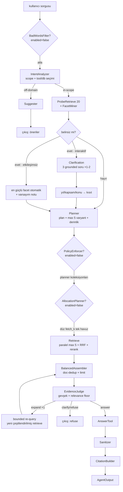
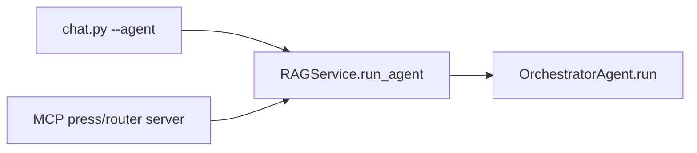

# `src/agent` — Agentic RAG Pipeline (OrchestratorAgent)

Tek bir agentic RAG hattı: `OrchestratorAgent` (`orchestrator.py`). Çok adımlı bir
sorguyu **niyet analizi → daraltma → planlama → arama → değerlendirme → yanıt** olarak
yürüten açık bir state machine'dir. (Eski `PlanningAgent` ve dispatch bayrağı kaldırıldı;
tek giriş noktası `RAGService.run_agent()` → `OrchestratorAgent.run()`'dır.)

Mimari, üst katmanda **Planned** (görev/sorgu bölme) ve alt katmanda **Turn-Based**
(grounded clarification) + **sınırlandırılmış ReAct** (bounded re-query) öğelerini birleştiren
hibrit bir yapıdır.

## Akış



Dispatch (giriş):



CLI (chat) interaktif `clarification_callback` sağlar (kullanıcıya 3 seçenek sorar);
MCP/batch callback geçmediği için **otomatik facet** yoluna düşer.

## Aşamalar (on/off)

Stage-2 aşamaları başlangıçta kapalıdır ve `pipeline.yaml` içinde stage-başına `enabled`
bayrağıyla açılır. Kapalıyken orchestrator makul bir fallback uygular.

| # | Aşama | Modül / sınıf | Başlangıç | Kapalıyken |
|---|---|---|---|---|
| 0 | BadWordsFilter | `bad_words_filter.py` `BadWordsFilter` | **off** | atlanır |
| 1 | IntentAnalyzer | `classifier.py` `ScopeClassifier` | on | (her zaman; devre dışıysa planner serbest seçer) |
| 1.5 | Probe + Facet | `clarifier.py` `FacetMiner` + `SearchTool` | on | — |
| 1.6 | Clarification | `clarifier.py` `AmbiguityGate`/`QueryRefiner` | on (belirsizlik-kapılı) | daraltma yok |
| 2 | Planner | `planner.py` `Planner` | on | — |
| 2a | PolicyEnforcer | `policy.py` `PolicyEnforcer` | **off** | allowed = planner-önerisi |
| 2b | AllocationPlanner | `allocator.py` `AllocationPlanner` | **off** | düz fetch_k tek havuz (reserve=0) |
| 3 | Retrieve | `orchestrator._run_retrieval` + `tools.SearchTool` | on | — |
| 4 | Assembler | `assembler.py` `BalancedContextAssembler` | on | — |
| 5 | EvidenceJudge | `judge.py` `EvidenceJudge` | on | — |
| 5.1 | Bounded re-query | `orchestrator._requery_expand` (veya `expander.py` reserve) | on (×1) | — |
| 6 | Answer/Sanitizer/Citations | `tools.py` / `sanitizer.py` / `citations.py` | on | — |

## Modüller

| Dosya | Sınıf | Sorumluluk |
|---|---|---|
| `orchestrator.py` | `OrchestratorAgent` | State machine; tüm aşamaları sıralar, fallback'leri uygular |
| `planner.py` | `Planner` | Niyet + kısıt → SearchPlan; `plan()` (max 5 varyant, derinlik) ve `broaden()` |
| `classifier.py` | `ScopeClassifier` | IntentAnalyzer: scope (in/off-domain) + tool/db seçimi; fail-open |
| `clarifier.py` | `FacetMiner`, `AmbiguityGate`, `QueryRefiner` | Prob metadatasından facet, belirsizlik kapısı, grounded did-you-mean |
| `policy.py` | `PolicyEnforcer` | Oturum ∩ planner koleksiyon gating (stage-2) |
| `allocator.py` | `AllocationPlanner` | query_type → primary/reserve/fetch_k bütçe (stage-2) |
| `assembler.py` | `BalancedContextAssembler` | Çapraz-koleksiyon doc-dedup + limit |
| `judge.py` | `EvidenceJudge` | Hibrit heuristik+LLM kanıt yeterliliği; relevance floor; answer/expand/clarify/refuse |
| `expander.py` | `ExpansionPlanner` | Reserve-promote stratejisi (alternatif; default `requery` orchestrator'da) |
| `sanitizer.py` | `SanitizerAgent` | Yanıt doğrulama + düzeltme |
| `citations.py` | `CitationBuilder` | Atıf listesi |
| `suggester.py` | `Suggester` | Off-domain alternatif sorgu önerileri |
| `bad_words_filter.py` | `BadWordsFilter` | LLM'siz yasaklı kelime kapısı |
| `tools.py` | `SearchTool`, `ContextBuilderTool`, `AnswerTool` | Retrieval+rerank / bağlam / üretim sarmalayıcı |
| `schemas.py` | Pydantic sözleşmeleri | `SearchPlan`, `OrchestratorState`, `FacetSet`, `ClarificationResult`, … |
| `tracer.py` | `PipelineTracer` | Aşama latency/trace olayları (UI callback) |

## Yapılandırma

Tüm ayarlar `pipeline.yaml` → `agent:`, `policy:`, `allocation:`, `judge:` bölümlerinde;
`src/config/pipeline_loader.PipelineConfig` üzerinden yüklenir.

**Production koleksiyonlar:** Agent yalnızca `models.yaml` içinde `production_ready: true`
işaretli koleksiyonlar üzerinde çalışır (probe, planner kataloğu, oturum). Deneysel/test
koleksiyonları görünmez. Bu nedenle terminal UI'daki manuel koleksiyon seçimi kaldırıldı;
sistem otomatik olarak `get_production_collection_keys()` evrenini kullanır.

Önemli bayraklar / parametreler:
- `agent.bad_words_filter.enabled`, `policy.enabled`, `allocation.enabled` — stage-2 on/off
- `agent.classifier.prompt` — scope + `selected_collections` döndüren niyet promptu
- `agent.clarification.*` — `enabled`, `probe_k`, `question_count`, `ambiguity.min_distinct_years`,
  `ambiguity.dominance_ratio`, `max_turns_normal`/`max_turns_deep`
- `agent.planner.normal_max_query_variants` — sorgu çeşitlendirme tavanı (breadth)
- `judge.heuristic.{min_chunks,min_collection_coverage,min_rerank_score}` — gevşeklik + relevance floor
- `judge.max_expand_iterations`, `judge.expand.strategy` (`requery` | `reserve`)

## Kullanım

```python
from src.generator.service import RAGService

service = RAGService()

# Etkileşimsiz (otomatik daraltma):
out = service.run_agent("1997 bütçe görüşmeleri", session_collections=["tutanaklar_ctx1024"])
print(out.answer)

# Etkileşimli (CLI): clarification_callback ile did-you-mean soruları
def clarify(questions):          # questions: list[ClarificationQuestion]
    return {"year": "1997"}      # {axis: seçilen değer}; boş/eksik = atla
out = service.run_agent("meclis ne konuştu", clarification_callback=clarify)
```

`AgentOutput` alanları: `.answer`, `.thinking`, `.scope`, `.suggestions`, `.plan`,
`.validation`, `.trace`, `.sources`, `.policy_result`, `.evidence_decision`, `.assembly`,
`.expanded`, `.clarification`.

## Yol haritası — hibrit mimari

Sıralama (yöntem · senaryo): **Turn-Based** (clarification/Self-RAG; doküman doğruluğu) →
**Planned** (sorgu çeşitlendirme; karşılaştırmalı/rapor) → **ReAct** (bounded re-query;
heterojen/keşifsel arama).

Aşamalı devreye alma:
1. **Stage-2 kapılarını aç** — `policy.enabled` (yetki/oturum sınırlaması), sonra
   `allocation.enabled` (query_type bazlı primary/reserve bütçe), gerekiyorsa
   `bad_words_filter.enabled`.
2. **Derinlik kararı** — Planner'ın `depth` parametresini niyet/ambiguity'ye bağlayarak
   `fetch_k`/expand bütçesini dinamikleştir.
3. **Daha geniş ReAct** — `max_expand_iterations`'ı artırıp heterojen kaynak (ör. SQL +
   vektör) için araç-seçimli döngüye genişlet.
4. **Çok turlu clarification** — derin/müfettiş modunda `max_turns_deep` ile iki turlu daraltma.

Her madde bağımsız bir bayrak/parametre arkasında olduğundan kademeli ve geri-alınabilir
şekilde açılabilir.
