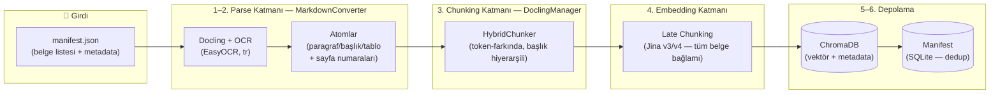
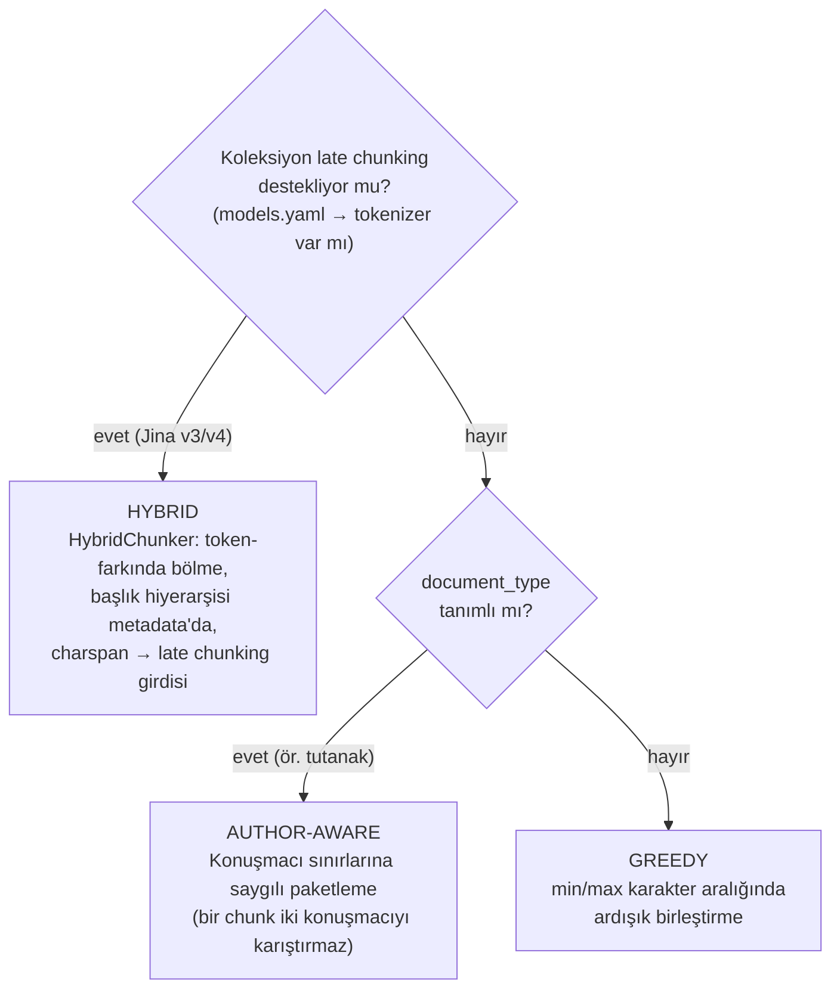

# Veri Yükleme Boru Hattı (Ingestion Pipeline)

PDF/DOCX belgelerini **yapı-farkında** (structure-aware) parse edip, **bağlam-duyarlı**
(late chunking) vektörlerle ChromaDB'ye indeksleyen uçtan uca boru hattı.

Tek komutla çalışır:

```bash
python -m src.trainer.ingestion.ingest --request manifest.json
```

---

## Mimari — Üç Katman

Boru hattı **üç bağımsız katmandan** oluşur. Her katman ayrı bir modüldür,
ayrı bir CLI'ı vardır ve diğerinden bağımsız çalıştırılabilir. Pipeline
yalnızca aralarındaki teli çeker — parse/chunk/embed kararlarını
kendi vermez.

```
┌─────────────────────────────────────────────────────────────────────┐
│  KATMAN 1 — PARSE  (PDF → Markdown)                                 │
│    src/common/parsing/                                              │
│      markdown_converter.py   PDF → atomlar + markdown + sayfalar    │
│      quality.py              Tier-1 OCR kalite sinyalleri           │
│  Bağımsız CLI:                                                      │
│      python -m src.common.parsing.markdown_converter --file X.pdf   │
├─────────────────────────────────────────────────────────────────────┤
│  KATMAN 2 — CHUNK  (atomlar → chunk'lar)                            │
│    src/common/parsing/                                              │
│      docling_manager.py      3 paketleme yolu (hybrid/author/greedy)│
│  Bağımsız CLI:                                                      │
│      python -m src.trainer.ingestion.ingest --inspect X.pdf         │
├─────────────────────────────────────────────────────────────────────┤
│  KATMAN 3 — INGEST  (orchestration)                                 │
│    src/trainer/ingestion/                                           │
│      pipeline.py             6 aşama, perf + kalite ölçümü          │
│      manifest.py             SQLite dedup state                     │
│      adapters/               tip bazlı metadata zenginleştirme      │
│  Bağımsız CLI:                                                      │
│      python -m src.trainer.ingestion.ingest --request manifest.json │
└─────────────────────────────────────────────────────────────────────┘
```

> **DevOps mesajı**: PDF→Markdown ayrı bir modüldür (KATMAN 1).
> Pipeline ona delege eder; KATMAN 1 hiçbir embedding/Chroma kodu içermez.
> Yukarıdaki ilk CLI bunun canlı kanıtıdır — hiç ChromaDB ya da embedder
> yüklemeden bir PDF'i markdown'a çevirip kalite raporu üretir.

---

## Sunum Demosu — Üç İzole Komut

Her katman, diğerleri olmadan çalıştırılabilir:

```bash
# 1) KATMAN 1 (PARSE-only) — PDF → markdown + kalite, sıfır ingest maliyeti
python -m src.common.parsing.markdown_converter --file belge.pdf
#   → data_lake/markdown/{kaynak}__{hash}.md
#   → data_lake/pages/{kaynak}__{hash}_pages.json
#   → data_lake/parse_cache/{md5}_atoms.json (quality alanı dahil)
#   → konsolda: "Kalite: bayraklı/temiz" satırı

# 2) KATMAN 1+2 (CHUNK-preview) — embed/upsert YOK, chunk önizlemesi
python -m src.trainer.ingestion.ingest --inspect belge.pdf \
    -c tbmm_minutes_docling_jina_v4 -t tutanak
#   → her chunk için sayfa, karakter, span, başlık hiyerarşisi
#   → "Span %100 ✓ — late chunking hazır" özet kararı

# 3) KATMAN 1+2+3 (FULL INGEST) — uçtan uca, ölçümlü
python -m src.trainer.ingestion.ingest --request manifest.json
#   → 6 aşama [n/6] satırları + perf paneli
#   → data_lake/reports/{document_id}.json sidecar (timings + kalite)
#   → manifest.db içine quality_json + perf_json
```

---

## Büyük Resim



Her aşamanın çıktısı diske yazılır — hiçbir adım "kara kutu" değildir, her ara ürün
incelenebilir (aşağıda *Disk Haritası*).

---

## Aşama → Kod Haritası

Konsol çıktısındaki `[n/6 ...]` etiketleri bu tabloyla bire bir eşleşir:

| # | Aşama | Ne yapar | Kod | Çıktı / Artefakt |
|---|-------|----------|-----|------------------|
| 1 | **MANIFEST** | `content_hash` karşılaştır; değişmemişse atla (URL'lerde ETag ile indirmeden atla) | `pipeline.py` → `run_document()` | SQLite: `data_lake/document_manifest.db` |
| 2 | **PARSE** | Docling + OCR → markdown atomları + sayfa numaraları | `markdown_converter.py` → `MarkdownConverter.convert()` | `parse_cache/{hash}_atoms.json`, `{hash}_doc.json` (Docling JSON — kanonik artefakt), `markdown/*.md` (insan-okur kopya), `pages/*_pages.json` |
| 3 | **CHUNK** | Atomları anlamsal parçalara paketle (3 yol: hybrid / author-aware / greedy) | `docling_manager.py` → `DoclingManager.pack()` | `parse_cache/{key}.json` (chunk önbelleği) |
| 4 | **EMBED** | Late chunking: tüm belge tek geçişte encode edilir, her chunk kendi span'inden havuzlanır | `embedder.py` → `LocalLateChunkingEmbedder` | bellek içi vektörler |
| 5 | **UPSERT** | `{document_id}_{i}` deterministik ID'lerle ChromaDB'ye yaz | `pipeline.py` → `collection.upsert()` | ChromaDB koleksiyonu |
| 6 | **DONE** | Manifest'e `done` + chunk sayısı + ETag yaz | `manifest.py` → `DocumentManifest.upsert()` | SQLite kaydı |

Belge tipine özgü metadata zenginleştirme (dönem, birleşim, konuşmacı...) 2. ve 3. aşama
arasında **adapter** katmanında olur: `adapters/tutanak_pdf.py`, `pdf_report.py`,
`kanun_teklifi.py`, `press_clip.py`. Yeni belge tipi = yeni adapter, boru hattına dokunulmaz.

---

## Disk Haritası — her ara ürün nerede?

```
data_lake/
├── document_manifest.db          # SQLite — hangi belge, hangi hash, kaç chunk, durum
├── parse_cache/                  # Makine önbelleği (silinebilir, yeniden üretilir)
│   ├── {md5}_atoms.json          #   Level-1: full_text + atomlar + quality (OCR sonucu)
│   ├── {md5}_doc.json            #   Level-1: DoclingDocument JSON — KANONİK artefakt
│   ├── {md5}.json                #   Level-2: paketlenmiş chunk'lar
│   └── quality_stats.json        #   document_type bazlı karakter/sayfa istatistikleri
├── markdown/
│   └── {kaynak}__{hash8}.md      # İnsan denetimi için okunabilir markdown
├── pages/
│   └── {kaynak}__{hash8}_pages.json  # Sayfa bazlı markdown ([{sayfa_no, sayfa_markdown}])
└── <koleksiyon dizinleri>/       # ChromaDB persistent client dizinleri (models.yaml'da tanımlı)
```

> **Tasarım kararı:** Docling **JSON** kanonik artefakttır; markdown yalnızca insan
> denetimi içindir. Chunking JSON'dan (DoclingDocument) yapılır — markdown'a düzleştirme
> tablo yapısını ve başlık hiyerarşisini kaybettirir. Yeniden chunk'lama / yeniden
> embedding **OCR'siz**, doğrudan bu artefaktlardan yapılır.

---

## Önbellek ve Idempotency — "tekrar çalıştırsam ne olur?"

Üç bağımsız katman vardır; her biri farklı bir soruyu yanıtlar:

| Katman | Anahtar | Geçersiz kılan değişiklik |
|--------|---------|---------------------------|
| **Level-1 (parse)** | dosya SHA-256 + OCR engine | PDF içeriği veya OCR motoru değişirse |
| **Level-2 (chunk)** | Level-1 anahtarı + tokenizer + `max/min_chunk_tokens` (hybrid) ya da `min/max_chars` (greedy) | Chunk parametreleri veya embed modeli değişirse |
| **Manifest (belge)** | `document_id` + `content_hash` (+ URL'lerde ETag) | Kaynak belge değişirse |

Pratik sonuçlar:

- Aynı manifesti **iki kez** çalıştırmak güvenlidir → her şey `[SKIP]` ile atlanır.
- Chunk parametresini değiştirmek **OCR'yi tetiklemez** → yalnızca Level-2 yeniden üretilir.
  En pahalı adım (OCR, GPU-dakikalar) yalnızca dosya gerçekten değiştiğinde çalışır.
- `--force` manifest kontrolünü atlar ama parse önbelleğini **kullanır**.
- Chunk ID'leri deterministik (`{document_id}_{i}`) → upsert çift kayıt üretmez;
  içerik değişen belgelerin eski chunk'ları upsert öncesi otomatik silinir.

---

## Tier-1 OCR Kalite Kontrolü

Parse sonrası her belge için otomatik kalite metrikleri hesaplanır
(`src/common/parsing/quality.py`, eşikler `settings.QUALITY_*`):

| Sinyal | Bayrak | Kural |
|--------|--------|-------|
| Atom yoğunluğu | `low_atom_density` | atom/sayfa < `QUALITY_MIN_ATOMS_PER_PAGE` |
| Karakter sapması | `char_count_outlier` | sayfa başına karakter, aynı `document_type` ortalamasından >%30 sapıyorsa (istatistikler `quality_stats.json`'da birikir, en az 3 başka belge gerekir) |
| OCR güveni | `low_ocr_confidence` | Docling'den erişilebiliyorsa ortalama güven < 0.85 |

Sonuçlar üç yere yazılır: `ParsedDocument.quality` + Level-1 `atoms.json`
içine `quality` alanı, her chunk metadata'sına `ocr_flagged: bool`, ve
manifest'e `quality_json` özeti. Bayraklı belgeler konsolda `[WARN]` ile
görünür. Türkçe'ye özgü ek sinyaller (ı/İ-i/I karışıklığı, ünlü uyumu ihlali
oranı) bilgi amaçlı `turkish_signals` altında taşınır — tek başına bayrak
üretmez.

> Geriye uyumluluk: `quality` alanı olmayan eski Level-1/Level-2 cache'ler
> geçerli sayılır — metrikler atomlardan yeniden hesaplanır, yalnızca OCR
> güven skoru (taze parse gerektirdiği için) `None` kalır.

---

## Üç Paketleme Yolu

`DoclingManager.pack()` koşullara göre tek bir yol seçer:



Üretimde tutanak koleksiyonları (Jina v4) **hybrid** yolu kullanır; ardından
`min_chunk_tokens` altındaki kırıntı chunk'lar bir sonrakiyle birleştirilir ve
konuşmacı etiketleri post-hoc uygulanır.

## Late Chunking Neden Var?

Klasik akışta her chunk **tek başına** embed edilir; "Sayın Bakan bu konuda..." gibi bir
parça, hangi bakan ve hangi konu olduğunu bilemez. Late chunking'de **tüm belge** (32K
token'a kadar, pencereli) tek geçişte modelden geçirilir, her chunk'ın vektörü kendi
token aralığından (span) havuzlanır. Sonuç: her chunk, belgenin tamamının bağlamını
taşır. Bu yüzden 2. aşamadan itibaren `span` (karakter aralığı) bilgisi titizlikle
korunur — `full_text` içindeki ofsetler embedding'in adresleridir.

---

## DevOps Runbook

### Normal akış

```bash
# 1. Manifest geçerli mi? (dosyalar var mı, URL'ler erişilebilir mi)
python -m src.trainer.ingestion.ingest --validate manifest.json

# 2. Ne işlenecek, ne atlanacak? (kuru çalıştırma, değişiklik yok)
python -m src.trainer.ingestion.ingest --diff manifest.json

# 3. Yükle (yalnızca yeni/değişmişleri işle; Rich progress bar gösterir)
python -m src.trainer.ingestion.ingest --request manifest.json --only-changed
```

### Gözlemleme

```bash
# Durum: koleksiyon başına done / pending / failed sayıları
python -m src.trainer.ingestion.ingest --status

# + Performans trendi: ort. parse/embed süresi, span coverage %, OCR bayrak oranı
python -m src.trainer.ingestion.ingest --status --report

# Belirli koleksiyon detayı (ilk 50 belge)
python -m src.trainer.ingestion.ingest --status -c tbmm_minutes_docling_jina_v4

# Belge başına uçuş kaydedici raporlar (JSON)
ls data_lake/reports/
cat data_lake/reports/tbmm-27-1-001-20110101.json
```

### Chunk önizleme — `--inspect` (demo için altın)

```bash
# PDF'i parse+chunk et; embed/upsert YOK — sıfır maliyet, anında sonuç
python -m src.trainer.ingestion.ingest --inspect belge.pdf

# Koleksiyon parametreleriyle (doğru tokenizer, chunk boyutları)
python -m src.trainer.ingestion.ingest --inspect belge.pdf \
    -c tbmm_minutes_docling_jina_v4 -t tutanak

# Daha fazla chunk göster
python -m src.trainer.ingestion.ingest --inspect belge.pdf --limit 50
```

Çıktı: her chunk için sayfa aralığı, karakter sayısı, span durumu (`—` = late chunking düşer),
başlık hiyerarşisi ve metin önizlemesi. Özet panelde "Span %100 ✓ — late chunking hazır" ya da
"X eksik ⚠ — fallback" kararı görünür.

### Diğer komutlar

```bash
# Koleksiyonlar ve chunk sayıları
python -m src.trainer.ingestion.ingest --list-collections

# Tek belgeyi sil (chunk'lar + manifest kaydı)
python -m src.trainer.ingestion.ingest --delete BELGE_ID -c KOLEKSIYON

# Yalnızca parse katmanını izole çalıştır (chunk/embed olmadan)
python -m src.common.parsing.markdown_converter --file belge.pdf
python -m src.common.parsing.markdown_converter --file belge.pdf --pages-json
```

**Çıkış kodları:** `0` = tümü başarılı/atlandı, `1` = en az bir belge `failed`
(hatalı belgeler özet panelinde listelenir; diğer belgeler işlenmeye devam eder —
bir belgenin hatası batch'i durdurmaz).

### Konsol çıktısını okumak

Her `--request` çalıştırmasında belge başına 6 satır + özet panel görünür:

```
[PIPELINE] tbmm-27-1-001-20110101 (tutanak)
  [1/6 MANIFEST] ✓ 8ms
  [2/6 PARSE] ✓ 4,250ms  · 142 parça · 45,320 karakter
  [3/6 CHUNK] ✓ 145ms    · 28 parça · span %100
  [4/6 EMBED] ✓ 3,100ms  · mod: late_chunking
  [5/6 UPSERT] ChromaDB: tbmm_minutes_docling_jina_v4
  [6/6 DONE] 28 parça eklendi.
  ╭─ tbmm-27-1-001-20110101 ──────────────────────────────────╮
  │ manifest 8ms  parse 4250ms  embed 3100ms  upsert 45ms     │
  │ toplam 7,553ms  28 parça · span 100%  ✓ uyarı yok        │
  ╰───────────────────────────────────────────────────────────╯
```

Sarı panel + `⚠ SPAN COVERAGE` → late chunking bu belgede standart embed'e düştü
(retrieval kalite kaybı — kök nedeni `DoclingManager._hybrid_pack` span çıkarımında ara).

**Sık karşılaşılan durumlar:**

| Belirti | Neden | Çözüm |
|---|---|---|
| `SKIP — content_hash eşleşiyor` | Belge değişmemiş | Beklenen; zorlamak için `--force` |
| `SKIP — ETag değişmemiş` | URL kaynağı değişmedi, indirme bile yapılmadı | Beklenen |
| `⚠ SPAN COVERAGE X eksik` | HybridChunker bazı öğelerde prov/charspan üretemedi | `--inspect` ile hangi chunk'ların span'siz olduğunu gör; Docling sürümü kontrol et |
| `⚠ ocr_flagged:N/M` | OCR kalite sinyali — atom yoğunluğu düşük veya karakter sapması yüksek | `data_lake/reports/` raporunu incele; düşük kaliteli PDF yeniden tara |
| `parse_error: ...` | Bozuk PDF, el yazısı, OCR çökmesi | `markdown_converter` CLI ile izole test; `--no-ocr` dene |
| `embed_error: ...` | GPU bellek / model indirme sorunu | İlk çalıştırmada model HuggingFace'ten iner; disk ve VRAM kontrol et |
| Yavaş ilk çalıştırma | OCR + model indirme | Normal; ikinci çalıştırma önbellekten saniyeler sürer |
| `parse_cache/` şişti | Önbellek birikti | Tamamı silinebilir — bir sonraki çalıştırmada yeniden üretilir (OCR maliyetiyle) |

---

## Mimari Kararlar

1. **Mantıksal modül sınırı, fiziksel servis değil.** Parse (`MarkdownConverter`),
   chunking (`DoclingManager`), embedding (`LocalLateChunkingEmbedder`) ayrı modüllerdir
   ama aynı repo ve aynı deployment'tadır. Ayrıştırma sınırı **artefakt deposudur**
   (`data_lake/`) — API ya da mesaj kuyruğu değil. Bu, yeniden işleme esnekliğini
   sıfıra yakın operasyonel maliyetle sağlar. Dönüştürücü ayrı servise ancak ölçülmüş
   bir GPU darboğazında terfi ettirilir.
2. **Konfigürasyon tek kaynaktan.** Koleksiyon + model tanımları `models.yaml`'da;
   yeni koleksiyon eklemek Python değişikliği gerektirmez (`--add-collection` sihirbazı
   ile). Boru hattının tüm davranışı `CollectionSpec` üzerinden enjekte edilir.
3. **Embed modeli indeks ve sorgu zamanında aynı olmak zorundadır** — `CollectionSpec`
   bu eşleşmeyi taşır; koleksiyona yanlış modelle yazmak yapısal olarak engellenir.
4. **OCR kalite izleme (Tier-1 — uygulandı).** Hiçbir OCR çözümü tam
   güvenilir değildir; Türkçe karakter seti (ı/İ, ğ, ş) ek hata yüzeyi ekler.
   Tier-1 sinyalleri parse anında otomatik hesaplanır
   (`src/common/parsing/quality.py`): atom yoğunluğu, document_type bazlı
   karakter sapması, OCR güveni; ek olarak Türkçe ı/İ-i/I karışıklığı ve
   ünlü uyumu ihlali sayaçları bilgi amaçlı taşınır. Bayraklar
   `ParsedDocument.quality`, her chunk metadata'sındaki `ocr_flagged` alanı
   ve manifest'in `quality_json` kolonuna yazılır; retrieval-time filtreleme
   V2'ye bırakıldı.

---

## Bilinen MVP Sınırları

Şeffaf olalım — şu sınırlar bilinçli MVP kararlarıdır, V2 backlog'undadır:

- **Quality stats warm-up.** İlk `QUALITY_STATS_MIN_DOCS=3` belge tip
  ortalaması olmadan bayraksız geçer; `char_count_outlier` ancak yeterli
  başka örnek biriktikten sonra anlamlıdır.
- **Tek-process istatistik dosyası.** `parse_cache/quality_stats.json` için
  dosya kilidi yoktur; paralel ingest race condition üretebilir. Sıralı
  çalıştırma varsayılır.
- **OCR confidence sürüm bağımlı.** Docling `ConfidenceReport` veya
  page-cell güvenleri yoksa kontrol atlanır (fail-open) — `low_ocr_confidence`
  bayrağı üretilmez, diğer iki bayrak çalışmaya devam eder.
- **`ocr_flagged` retrieval'da kullanılmıyor.** Şu an yalnızca yazılır;
  V2'de opsiyonel `where` filtresi olarak retrieval'a entegre edilecek.
- **Cache backfill yok.** quality alanı olmayan eski Level-1 atoms.json
  dosyaları okuma anında yeniden hesaplanır (atomlar yeterli) ama diske
  geri yazılmaz; yalnızca `ocr_mean_confidence` taze parse gerektirdiği
  için `None` kalır.
